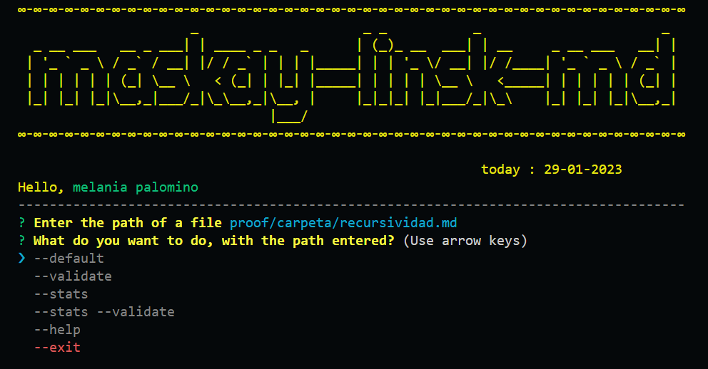

#  Welcome 👩‍💻


# contents


* [1 . Project objectives](#1-project-objectives)
* [2 . Project flow chart](#2-Project-flow-chart)
  - [API](#-API)
  - [CLI](#-CLI)
* [3 . Documentation](#3-Documentation)
     - [Installation](#-Installation)
     - [usage](#-usage)
     - [Commands](#-Commands)
     - [Example](#-Example)

---

#  [1. Project objectives](#1-project-objectives)

The maskay-links-md library parses files with the extension [Markdown](https://en.wikipedia.org/wiki/Markdown), allows you to obtain all the existing links within a file and with the commands you will be able to know more details about each and total statistics.


# [2 . Project flow chart](#2-Project-flow-chart)
  - ## [API development](#-API)

  

  - ## [CLI(Command Line Interface) Development](#-CLI)

  

# [3. Documentation](#3-Documentation)
 - ## [Installation](#Installation)
 ```
 npm 
 ```

- ## [Usage](#-Usage)

The default behavior does not validate if the URLs respond ok or not, it only has to identify the markdown file (from the path it receives as an argument), analyze the Markdown file and print the links it finds, along with the file path where it appears and the text inside the link.

Use the library in the terminal, with the following command:

```
maskay-links-md
 ```
After that it will ask you to place a path, this can be relative or absolute.

Choose an option:
```
--default
--validate
--stats
--stats --validate
--hepl
--exit
```


- ## [Commands](#-Commands)

### **Arguments**

 ### path
   Absolute or relative path to the file or directory.


### **Options**

 ```
--default
```
Shows basic information about the content of the inspected file

```
--validate
```
If we choose the `--validate `  option, the module must make an HTTP request to
find out if the link works or not. If the link results in a redirect to a
URL that answers ok, then we will consider the link as ok, otherwise it will be false

* `href`: URL found.
* `text`: Text that appeared inside the link (`<a>`).
* `file`: Path of the file where the link was found.
* `status`: HTTP response code.
* `ok`: Message `fail` in case of failure or `ok` in case of success.

```
 --stats
 ```
If we pass the `--stats` option the output will be a text with statistics
Basics about links.

   * `Total`: Total links within the file you are inspecting
   * `Unique`: Total number of links within the file you are inspecting that do not repeat

```
--stats --validate
```
We can also combine `--stats` and `--validate` to get statistics that
need the validation results.
```
--help
```
Information about stock options.
```
--exit
```
Close or exit the program

- ## [Example](#-Example)

For example:
```md
### this is a content of a .md file
  
  [google]( http://google.com/)
  [yahoo]( http://search.yahoo.com/)
  [msn](http://search.msn.com/)
  [hotmail](http://hotmail.com/)
  [trend google](https://trends.google.com.mx/trends/explore?q=react,angular,vue)

```
 Results :
 
  Open the terminate and run maskay-links-md
  

  Result when executing the option `--default`
  

  Result when executing the option `--validate`
  

  Result when executing the option `--stats`

  

  Result when executing the option `--stats --validate`

  

  Result when executing the option `--help`

  